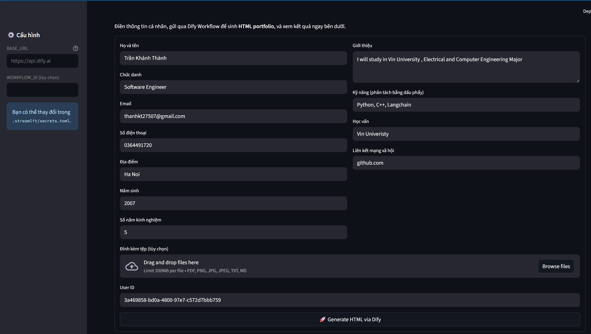
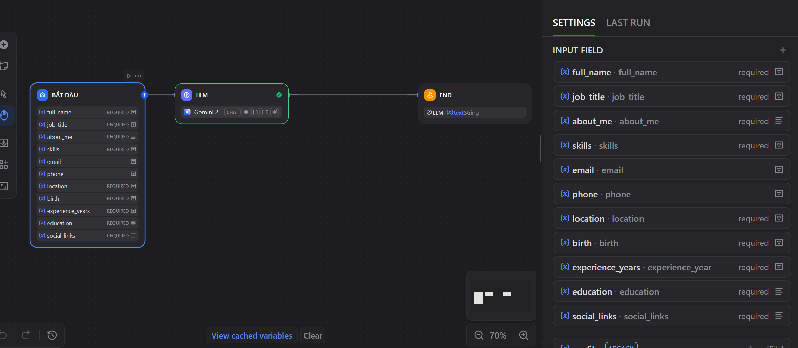

# demo-dify

Small Streamlit demo that calls a Dify Workflow to generate a complete HTML portfolio and render it in the browser.

This repo contains:

- `app.py` - Streamlit UI and helper functions that call the Dify Workflows API and extract HTML from the response.
- `test_extraction.py` - tiny local test that validates the HTML extraction logic against the sample `output.json`.
- `output.json` - example workflow response (contains the HTML wrapped in a Markdown code block).
- `pyproject.toml` - Python dependency manifest.

## Features

- Calls Dify Workflows (blocking mode) and shows raw response.
- Extracts raw HTML even when the Workflow returns explanatory text + a Markdown code block (```html ... ```).
- Renders the HTML inline in Streamlit and offers a download button for the generated `portfolio.html`.

## Requirements

- Python 3.11+
- See `pyproject.toml` for pinned dependencies (Streamlit, requests).

## Configuration

The app needs the Dify API key and optional configuration. You can provide them via Streamlit secrets or environment variables.

- `DIFY_API_KEY` (required) — API key for your Dify instance.
- `BASE_URL` (optional) — Dify base URL (default: `https://api.dify.ai`).
- `WORKFLOW_ID` (optional) — workflow id when you prefer the `/v1/workflows/{id}/run` endpoint.

Recommended: create a file `.streamlit/secrets.toml` with:

```toml
[default]
DIFY_API_KEY = "your_api_key_here"
BASE_URL = "https://api.dify.ai"
WORKFLOW_ID = ""  # optional
HTTP_TIMEOUT = 180  # optional, seconds
```

Or export env vars in your shell:

```bash
export DIFY_API_KEY=your_api_key_here
export BASE_URL=https://api.dify.ai
export WORKFLOW_ID=
export HTTP_TIMEOUT=180
```

## Run

Start the Streamlit app from the project root:

```bash
streamlit run app.py
```

Open the browser at the address Streamlit prints (usually `http://localhost:8501`). Fill the form and click "Generate HTML via Dify".

## How HTML extraction works

The Workflow often returns a textual explanation followed by a Markdown code block containing the full HTML, e.g.:

```
Chắc chắn rồi! ...
```html
<!DOCTYPE html>
<html>...</html>
```

`app.py` contains `extract_html(result)` which tries a few common paths in the API response (including `data.outputs.output`) and:

- If the found value is a string, it first tries to extract HTML inside Markdown code blocks labeled `html` (handles variations of backtick counts).
- If no code block is present, it checks for raw `<html` or `<!doctype html` substrings and returns that string.
- If the workflow returned streamed `events`, it will attempt to combine them and extract HTML from the combined text.

This makes the app resilient to the common Dify patterns where the model includes human readable text around the HTML.

## Quick test (local)

There is a small test harness that verifies extraction against the included `output.json` (which mimics your workflow response):

```bash
python test_extraction.py
```

Expected: the script prints a success message and the extracted HTML snippet.

## Troubleshooting

- If you see `Thiếu DIFY_API_KEY` in the UI, ensure `DIFY_API_KEY` is present in `.streamlit/secrets.toml` or the environment.
- If Streamlit shows the raw response but no HTML, check that your Workflow's final node outputs either `html` or an `output` that contains the full HTML. The extractor now checks `data.outputs.output` first.
- Large HTML payloads may take time; the HTTP timeout in `app.py` defaults to 180 seconds for blocking response mode (configurable via `HTTP_TIMEOUT`).

## Notes & Next steps

- If you want the app to support more response shapes, add additional candidate paths in `extract_html`.
- Consider sanitizing or sandboxing untrusted HTML before rendering in production.



